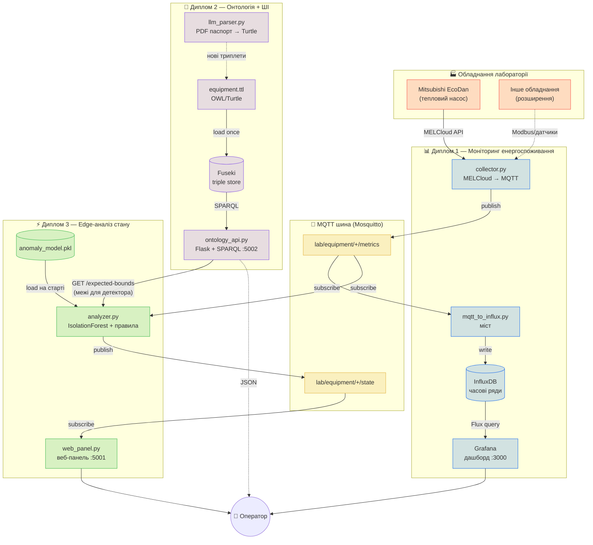
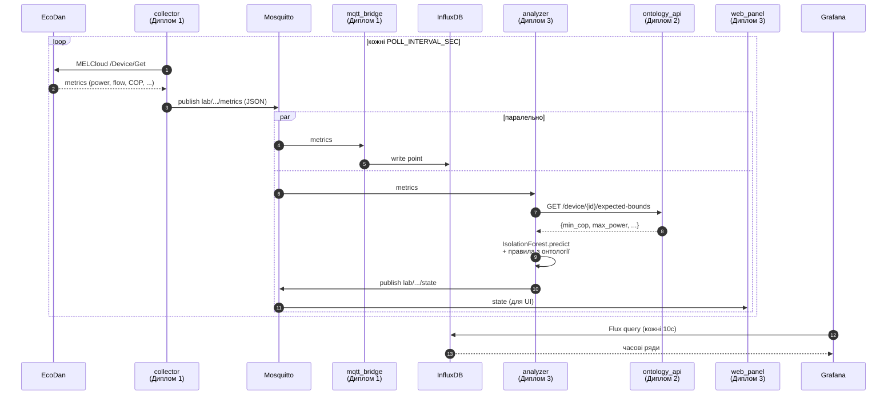
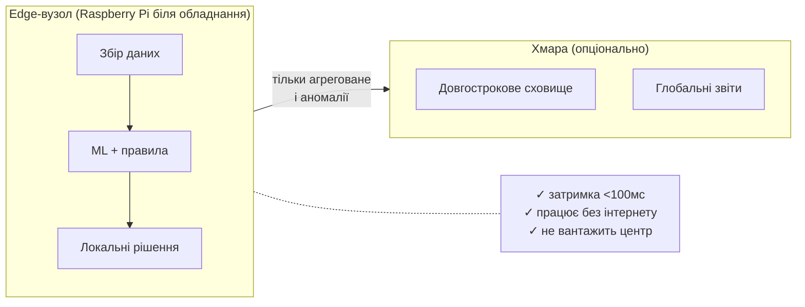

# Архітектура системи

## Загальна схема



## Потік одного циклу (sequence)



## Спільний контракт

Усі три підсистеми узгоджують формати у [shared/schemas.py](shared/schemas.py).
Без цього контракту жодна інтеграція між дипломами не працює.

```
Topic: lab/equipment/{device_id}/metrics        ← публікує collector
{
  "device_id": "ecodan_01",
  "timestamp": "2026-04-20T14:30:00Z",
  "metrics": {
    "power_kw": 2.4, "energy_kwh": 15.7,
    "flow_temp_c": 45.2, "return_temp_c": 38.1,
    "outdoor_temp_c": 5.0, "cop": 3.8, "mode": "heating"
  }
}

Topic: lab/equipment/{device_id}/state          ← публікує analyzer
{
  "device_id": "ecodan_01",
  "timestamp": "2026-04-20T14:30:01Z",
  "state": "normal" | "warning" | "anomaly",
  "anomalies": ["cop_below_nominal(2.5<2.8)", "ml_outlier"],
  "confidence": 0.87,
  "explanation": "ML score=-0.12; rules matched: 1"
}
```

## Розподіл відповідальності між дипломами

| Диплом | Роль | Фізичний рівень | Логічний рівень | Результат захисту |
|---|---|---|---|---|
| **1** Моніторинг | Збирач даних | Edge-вузол біля обладнання | Транспорт + візуалізація енергоспоживання | Дашборд Grafana в реальному часі |
| **2** Онтологія + ШІ | Довідник/мозок | Triple store | Семантика: що означають метрики, які межі, які режими | Онтологія + API + автопарсер паспортів |
| **3** Edge-аналіз | Діагност | Edge-вузол | Гібридне рішення: ML-модель + правила з онтології | Веб-панель стану + порівняння edge vs cloud |

Кожна робота захищається самостійно, але разом демонструє повний стек:
**сенсор → передача → зберігання → семантика → аналіз → рішення оператору**.

## Edge-принцип (для захисту Диплому 3)


